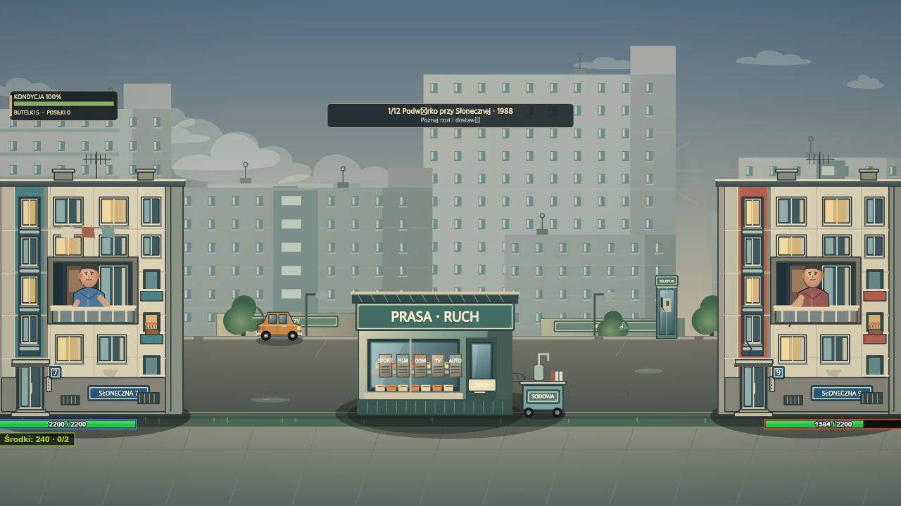
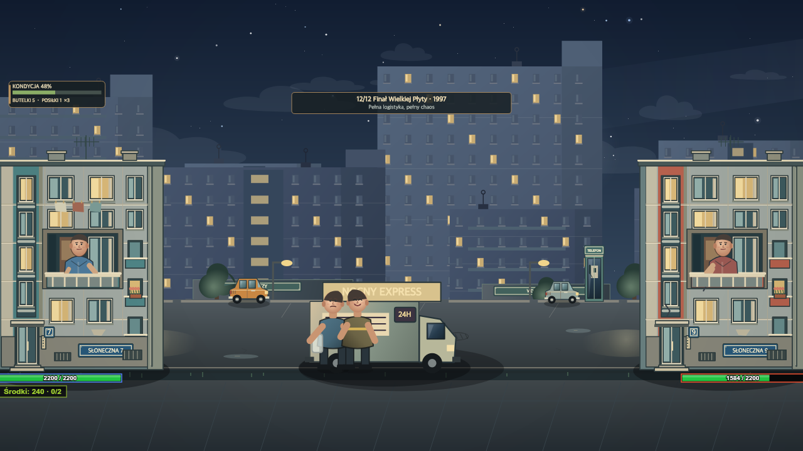
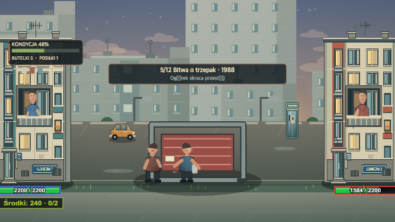

# Osiedle — Polska lat 80. i 90.

Wersja 8.4.0 przywraca cały osiedlowy rozdział z dwunastoma etapami. Przycisk
„OSIEDLE · POLSKA LAT 80. I 90.” otwiera go bezpośrednio z menu. Czwarty
poziom „Silniki i Radio” nadal jest fortem swojej epoki. Osiedle nie zmienia
zapisu historycznej kampanii.

## Kierunek wizualny i wynik

Główne bryły to mieszkalne bloki z wielkiej płyty: ciągła płaska linia dachu,
podziały prefabrykatów, pas klatki schodowej, głęboka loggia bohatera,
wejście z lastryko i piwniczne kratki. Odcienie kości słoniowej, zgaszonej
zieleni, ochry i ceglanej czerwieni łączą budynki z pawilonami. Noc zmienia
paletę całej sceny, a jasne okna i latarnie pozostają akcentami.

Polskie motywy są rozłożone między plany, żeby nie zasłaniać postaci:

- pierwszy etap: kiosk Prasa/Ruch z gazetami i saturator,
- dalszy plan: maluch, przeszklona budka telefoniczna, Spożywczy,
- fasady: emaliowane numery i tabliczki „Słoneczna”, anteny telewizyjne,
  pelargonie, domofon i poruszające się pranie,
- późniejsze etapy: Video/Kasety, gastronomia, nocna brama i dostawczy express.

Sceny „1988” i „1997” są artystyczną interpretacją dwóch okresów,
nie rekonstrukcją konkretnego osiedla. Motyw małego Fiata na osiedlowym
parkingu ma odniesienie w [archiwum NAC](https://audiovis.nac.gov.pl/obraz/205253%3A6/).
Konstrukcję saturatora konsultowano z [opisem eksponatu muzealnego](https://zabytki-techniki.org.pl/index.php/historia/82-ciekawostki/576-saturator-ikona-prl).
Żadne zdjęcia archiwalne nie są kopiowane do gry; grafika jest rysowana w Canvas.

## Korekty wynikające z przeglądu renderów

Ulica i centralny obiekt były rysowane po bocznych fasadach, przez co zakrywały
ich wejścia. Kolejność jest teraz następująca: niebo, nieprzezroczyste tło,
ulica i centralny obiekt, bazy, postacie, pociski, HUD.

Punkt uderzenia butelki korzysta z tego samego przeliczenia skali co loggia.
Skala centralnego obiektu ma ograniczenie zależne od szerokości ekranu.
Na pierwszym planie występuje najwyżej jedna para postaci tła.
Cache teł zachowuje maksymalnie cztery obrazy i uwzględnia dokładny viewport.

## Weryfikacja

Test gry obejmuje zakup, opóźnienie rzutu, obrażenia, dostawy, jedzenie,
pauzę, obie wgrane twarze, pełną bitwę i powrót do poprzedniej kampanii.
Sprawdza też geometrię baz i punkt trafienia przy 1280×720, 1950×1100,
844×390 i 667×375. Osobny test zapobiega powrotowi dziennego nieba w finale.
Rendery wszystkich dwunastu scen służą do przeglądu; same w sobie nie są
testem automatycznym jakości artystycznej.

Podglądy poniżej pochodzą z renderera gry, bez DOM-owego paska kart.
Nie zastępują testu dotyku, importu z biblioteki zdjęć ani wydajności na
fizycznym iPhonie. Takiego testu w tej iteracji nie przeprowadzono.
Określenie „światowy poziom” jest celem jakościowym, nie wynikiem testów.

